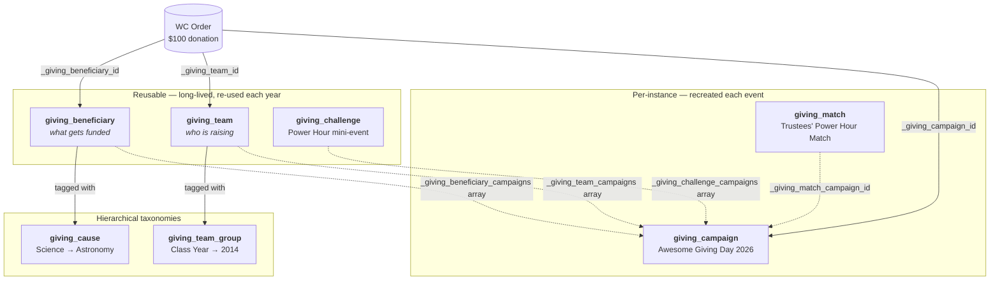

# Giving Day Blocks

An out-of-the-box, open-source **Giving Day** product for WooCommerce. A set of purpose-built Gutenberg blocks, a shared data layer, and an admin dashboard that let any organization launch a complete fundraiser event in minutes instead of months.

## Requirements

- **WordPress 6.7+** (for FSE template registration)
- **WooCommerce** (for donation products and order handling)
- **PHP 7.4+**

## What you get

Seven blocks designed to work together during a Giving Day event:

| Block | Purpose |
|-------|---------|
| `giving-day/goal-progress` | Goal + progress bar. Supports Campaign, Team, and Beneficiary targets (auto-detects from the current post type). Horizontal and vertical layouts. |
| `giving-day/countdown` | Unified hero slot. Pre-event countdown → event-day countdown → final totals, transitioning automatically on `server_time`. Toggle `hidePostEvent` to pair with a standalone Totals block elsewhere. |
| `giving-day/totals` | Standalone totals. `mode: auto` shows the running number while live and the final once the event ends; `mode: final-only` stays hidden until the event ends. |
| `giving-day/leaderboard` | Top donors, teams, campaigns, or causes. Configurable dimension and size. |
| `giving-day/match-my-gift` | Sponsor matching banner that doubles donation urgency. |
| `giving-day/challenges` | Time-boxed mini-events (e.g. "50 donations in the next hour unlocks $10,000"). |
| `giving-day/war-room` | Back-office live dashboard for organizers. Block + standalone admin page. |
| `giving-day/donate-button` | Donate call-to-action that auto-tags donations with the current Team or Beneficiary via URL params. |

## Single Team / Beneficiary pages

This plugin ships FSE block templates that render a goal progress bar (when a goal is set) and a Donate button on every single Team and single Beneficiary post page.

**Requirements:**
- WordPress 6.7+ (for `register_block_template()`).
- A block (FSE) theme. The plugin's FSE templates have no effect on classic themes.

**Theme overrides:** If your active theme ships its own `single-giving_team.html` / `single-giving_beneficiary.html`, that theme template takes precedence over the plugin's. The plugin templates are a fallback for block themes that don't provide their own.

**Donation page:** Configurable at **Settings → Reading → "Donation page"**. Defaults to `/donate`. For programmatic override, filter `giving_day_donation_page_url`.

All blocks are:

- **Mobile-first and responsive** (SCSS with shared tokens and a `media()` breakpoint mixin).
- **Theme-aware** — styles pull from `theme.json` via CSS custom properties (`var(--wp--preset--color--primary)` etc.). No hardcoded colors or fonts.
- **Accessible** — visible focus, `aria-live` on live-updating regions, `role="progressbar"`, and `prefers-reduced-motion` support.
- **Server-rendered first** — blocks work without JavaScript; `view.js` upgrades them with live refresh when available.
- **Drift-corrected** — all countdowns are anchored to server time returned by the REST API, never the browser clock.

## Data model

### Custom Post Types

Five custom post types, all `show_in_rest` and registered under the `giving-day/v1` REST namespace:

| Post type | REST base | Purpose |
|-----------|-----------|---------|
| **`giving_campaign`** | `campaigns` | The event itself: pre-event start, start/end, timezone, goal amount, currency, and linked WooCommerce donation products. One post per event run (recreated each year). |
| **`giving_team`** | `teams` | *Who* is raising — a group of fundraisers. Long-lived; references one or more campaigns via `_giving_team_campaigns`, has a captain user, optional team goal. |
| **`giving_beneficiary`** | `beneficiaries` | *What* gets funded — the destination of a donation. Surfaced in the admin as **"Beneficiary / Fund"** so the same screen reads naturally for both audiences (universities call them *funds*; community foundations call them *beneficiaries* / *partner nonprofits*). **Hierarchical**: nest funds under a parent unit (e.g. *College of Arts & Sciences → Dean's Excellence Fund*) to roll up per-unit totals, or keep flat top-level posts and use the optional `_giving_beneficiary_parent_org` string as a display fallback. Long-lived; references one or more campaigns via `_giving_beneficiary_campaigns`. |
| **`giving_match`** | `matches` | Sponsor match tied to a single campaign: multiplier, cap amount, active window, sponsor label. One-off per event. |
| **`giving_challenge`** | `challenges` | Reusable, time-boxed mini-event: type (`donation_count` / `amount_raised` / `team`), threshold, reward, and a *relative* window (e.g. `PT0H–PT1H`) resolved per campaign. |

All five are registered as `show_ui` + `show_in_rest`, grouped under a single **Giving Day** admin menu, and are non-public (`public => false`, `has_archive => false`, `rewrite => false`) — they are data containers for blocks, not browsable URLs.

### Taxonomies

Two hierarchical taxonomies, both `show_in_rest`:

| Taxonomy | REST base | Attached to | Purpose |
|----------|-----------|-------------|---------|
| **`giving_cause`** | `causes` | `giving_beneficiary` | Powers the "Give to a cause" browsing flow. Top-level terms (e.g. *Science*, *Arts & Humanities*) contain sub-causes (e.g. *Astronomy*, *Music*). A beneficiary / fund can be tagged with multiple terms. |
| **`giving_team_group`** | `team-groups` | `giving_team` | Powers tabbed/faceted leaderboards. Top-level terms are grouping dimensions (e.g. *Class Year*, *Athletic*, *Department*); child terms are the buckets (e.g. *2014*, *Rowing*, *Engineering*). A team can carry multiple tags across dimensions. |

Both taxonomies are hierarchical, non-public, admin-visible (`show_admin_column => true`), and their terms are intentionally long-lived — they persist across every Giving Day.

## REST API

Namespace: `giving-day/v1`. Read endpoints are public; write endpoints require `manage_options`.

| Endpoint | Returns |
|----------|---------|
| `GET /campaign/{id}/summary` | Goal, raised, percent, donor count, event window |
| `GET /campaign/{id}/countdown` | Pre-event start, start, end, and `server_time` (ISO 8601) |
| `GET /campaign/{id}/leaderboard?dimension=&limit=` | Top donors / teams / campaigns / causes |
| `GET /match/{id}/progress` | Matched so far, cap, remaining |
| `GET /challenge/{id}/progress` | Current value, threshold, window remaining |
| `GET /campaign/{id}/warroom` | Aggregated payload for the dashboard |
| `GET /teams?q=&limit=&id=&campaign_id=` | Team typeahead source for the donation form's "On behalf of" chip. Returns `[{id, label}, …]`. `id={N}` resolves a single record for URL-prefill. Defaults the scope to the currently-live campaign. |
| `GET /beneficiaries?q=&limit=&id=&campaign_id=` | Same shape as `/teams`, sourcing the donation form's "Supporting" chip. Labels include the parent unit when present (e.g. *"Dean's Excellence Fund — College of Arts & Sciences"*). |

Every response includes a `server_time` field so client countdowns never drift.

## Directory layout

```
giving-day-blocks/
├── giving-day-blocks.php       # Plugin bootstrap, dependency checks
├── functions.php
├── composer.json               # PSR-4: Team51\GivingDay\
├── package.json                # wp-scripts, jest, jest-preset-default
├── jest.config.js
├── blocks/
│   ├── src/
│   │   ├── _shared/            # Shared hooks, tokens.scss, utilities
│   │   ├── goal-progress/
│   │   ├── countdown-pre/
│   │   ├── countdown-event/
│   │   ├── totals-post/
│   │   ├── leaderboard/
│   │   ├── match-my-gift/
│   │   ├── challenges/
│   │   └── war-room/
│   └── build/                  # Generated — do not edit
├── src/                        # PSR-4 PHP
│   ├── Plugin.php
│   ├── Blocks.php
│   ├── PostTypes/
│   ├── Data/Aggregator.php
│   ├── REST.php
│   ├── Admin/
│   └── Integrations/Donations.php
├── assets/                     # Admin React (War Room admin page)
├── tests/js/                   # Jest tests per block
└── languages/
```

## Development

### Setup

```bash
cd wp-content/plugins/giving-day-blocks
composer install
npm install
```

### First-activation sample data

On first activation (and only then), the plugin seeds a tiny "Hello Dolly"-style data set so the admin and block editor have something to render out of the box: one Campaign dated to the current year, two Teams, one Beneficiary, one Match, one Challenge, and a short hierarchy under each taxonomy. Seeding is skipped if any Campaign already exists, so it never clobbers real content.

To re-seed during development, delete the sample posts and clear the "already seeded" marker:

```bash
wp option delete giving_day_blocks_seeded_ids
wp post delete $(wp post list --post_type=giving_campaign,giving_team,giving_beneficiary,giving_match,giving_challenge --format=ids) --force
# then deactivate + reactivate the plugin
```

### Scripts

```bash
npm run start         # Watch mode for blocks
npm run start:admin   # Watch mode for the Campaign sidebar bundle
npm run build         # Production build: blocks + admin bundle
npm test              # Run Jest suite
npm run test:watch
npm run lint          # ESLint + Stylelint + pkg-json
npm run format        # Auto-fix JS/SCSS
composer run lint:php
composer run format:php
```

### Previewing event states

The `countdown` and `totals` blocks accept a `?givingday=` URL parameter that forces a specific state, for editors who want to preview a page mid-development:

| Value | Forced state |
|-------|--------------|
| `?givingday=pre` | Pre-event countdown (scheduled) |
| `?givingday=live` | Event-day countdown + running total |
| `?givingday=post` | Ended — final totals |

The override is **only honored for logged-in users** (server-side `is_user_logged_in()` / client-side `body.logged-in`). Anonymous visitors with the parameter see the real state. Each block also has an **Editor preview state** dropdown in the inspector that does the same thing inside the editor canvas.

Until the WooCommerce-order Aggregator lands, the running-raised number is driven by two temporary meta fields on the Campaign — **Dev: raised override** and **Dev: donor count override** — editable from the Campaign sidebar. Both are removed in favor of real aggregation later without changing the block markup.

### Donor designation chips

Donors who reach the donation form see two **chips** above the submit button — a two-line text label with a small prefix above the value, plus a `[change]` affordance — instead of two raw form fields:

```text
You are giving to
Library                            [change]

You are giving on behalf of
Class of 2014 Crew                 [change]
```

When the donor taps `[change]`, the value swaps in place for a focused typeahead scoped to the currently-live campaign. **ESC** or a click outside cancels without committing. Chips are visually transparent by default — no background, no border, no rounded button — so site themes can style them with their own CSS via the stable class hooks (`.wpcomsp-donations__chip`, `…__chip-prefix`, `…__chip-body`, `…__chip-action`).

The chips are not Giving Day blocks. They are registered against the [team51-donations](../team51-donations/) **Custom Fields API** (`wpcomsp_donations_register_field()`) as two consumer-side fields with `appearance: 'chip'`. The visual treatment and modal interaction live in team51-donations; this plugin only declares the fields, supplies the typeahead REST endpoints (`/teams`, `/beneficiaries`), and routes the donor's selections into `_giving_team_id` / `_giving_beneficiary_id` order meta — the same meta the order-attribution listener writes, so the Aggregator's slicing is unchanged.

Pre-fill priority is: **URL param > session context > empty.**

| Source | Behavior |
|--------|----------|
| `?gd_team=701&gd_beneficiary=612` on any page | Chips arrive populated; captains can paste shareable links anywhere. |
| Visiting a Team or Beneficiary single-post page | `Team51\GivingDay\Data\Context::set()` fires on `template_redirect`; the chip's `default_callback` reads it back. |
| Donor changes their mind mid-form | The modal commits the new value to the hidden form input. The donor's explicit choice wins over session-derived attribution at order creation. |

The chips are auto-registered when team51-donations is active. Sites that build their own designation UI can opt out via:

```php
add_filter( 'giving_day_blocks_register_donation_chips', '__return_false' );
```

### Per-campaign brand colors

The **Brand colors** panel on the Campaign edit screen lets each event define its own palette: Primary, Secondary, Accent, Surface, and Muted. Each field writes a hex value to meta, and `render.php` emits them on the block wrapper as inline CSS custom properties:

```html
<div class="giving-day-countdown …"
     style="--giving-day-primary: #e5007d; --giving-day-accent: #ffb400;">
```

`blocks/src/_shared/tokens.scss` already declares `--giving-day-*` with a `theme.json` fallback, so any cleared field transparently returns to the site-wide default. Editor previews use the same mechanism via `campaignColorStyle()` (`blocks/src/_shared/utils/campaignColorStyle.js`) so what you see in the canvas matches the front end. Since the override lives on the block wrapper, two campaigns on the same page can use different palettes without collision.

### Conventions

- **Namespace:** `Team51\GivingDay\` (PSR-4 via Composer).
- **Text domain:** `giving-day-blocks`.
- **Block namespace:** `giving-day/*`.
- **Styles:** SCSS, mobile-first. Use tokens from `blocks/src/_shared/tokens.scss`; never hardcode colors or fonts — pull from `theme.json` via CSS custom properties.
- **Breakpoints:** `@include media(sm|md|lg)` mapped to 600 / 782 / 1080 px.
- **Server render first** (`render.php`); `view.js` is for live updates only.
- **Accessibility:** focus states, `aria-live="polite"` for live regions, `prefers-reduced-motion` respected.
- **i18n:** always use text domain `giving-day-blocks`. Run the internationalization script after adding strings.

### Testing

Tests use **Jest** with `@wordpress/jest-preset-default` in a `jsdom` environment. Every block has at least:

1. A placeholder-state test (no campaign selected).
2. An attribute-update test (campaign picker changes state).
3. A snapshot of save output or `view.js` DOM render.

Shared hooks (`useCountdown`, `useLiveRefresh`) have their own unit tests under `tests/js/_shared/`.

`@wordpress/api-fetch` and `@wordpress/data` are mocked via `tests/__mocks__/`.

## Concepts by example

The data model is best understood through a concrete scenario. Imagine **Awesome University** is running its annual Giving Day. Here's what each record looks like, and how they connect.

> The same model works for **community-foundation Giving Days** (where each Beneficiary is an external partner nonprofit instead of an internal university fund). Where the two shapes diverge — chiefly in how Beneficiaries are organized — both are shown side-by-side below.

### How the pieces connect



### 1. `giving_campaign` — the event instance

One per event run. Recreated every year.

```
Title:   Awesome Giving Day 2026
Post ID: 501

Meta:
  _giving_pre_event_start  = 2026-02-20T00:00:00-05:00    # countdown starts
  _giving_start_datetime   = 2026-03-12T00:00:00-05:00    # event opens
  _giving_end_datetime     = 2026-03-13T00:00:00-05:00    # 24h later
  _giving_timezone         = America/New_York
  _giving_goal_amount      = 10,000,000
  _giving_currency         = USD
  _giving_donation_products = [ 847 ]
```

Next year: a brand-new post (`Awesome Giving Day 2027`, ID 502). Nothing else is cloned.

### 2. `giving_cause` — browsable category tree (taxonomy)

The top-level buttons on the "Give to a cause" page.

```
Arts & Humanities
  ├─ Music
  └─ Visual Arts
Science
  ├─ Animal Health
  ├─ Astronomy
  └─ Environmental
Athletics
Community & Outreach
```

Terms are permanent — they persist across every Giving Day.

### 3. `giving_beneficiary` — *what* gets funded

The destination of a donation. Long-lived; participates in many campaigns. The
admin label is **"Beneficiary / Fund"** so the same screen reads naturally
whether you're a university running internal funds or a community foundation
listing partner nonprofits.

The CPT is **hierarchical**, which lets the same model serve both shapes
without a second post type.

#### University example — nested funds with per-unit roll-up

```
Post 610 — "College of Arts & Sciences"   ← parent post (a "unit")
  campaigns = [ 501, 502 ]
  goal      = 1,000,000          # rolled-up totals are reported against this
  causes    = [ Arts & Humanities ]

  ├─ Post 611 — "Dean's Excellence Fund"
  │    post_parent = 610
  │    campaigns  = [ 501, 502 ]
  │    goal       = 250,000
  │    causes     = [ Arts & Humanities ]
  │
  ├─ Post 612 — "Center for Planetary Studies"
  │    post_parent = 610
  │    campaigns  = [ 501, 502 ]
  │    goal       = 250,000
  │    causes     = [ Science, Astronomy ]
  │
  └─ Post 614 — "University Concert Series"
       post_parent = 610
       campaigns  = [ 501 ]      # only 2026 this year
       goal       = 50,000
       causes     = [ Arts & Humanities, Music ]
```

The Aggregator answers *"how much did the College of Arts & Sciences raise?"*
by summing post 610 plus all of its descendants. Per-unit goals are real,
single-CPT.

#### Community-foundation example — flat list with `parent_org` fallback

When there's no real hierarchy to model, beneficiaries are flat top-level
posts. The free-form `_giving_beneficiary_parent_org` label provides an
optional display string (e.g. coalition or umbrella name) without a parent
post. `Beneficiary::display_unit_label()` in the plugin resolves the right label for
either shape — parent post title when set, otherwise this string.

```
Post 720 — "Local Food Bank"
  campaigns  = [ 501 ]
  parent_org = "Member of: Health Coalition of Travis County"
  causes     = [ Community & Outreach ]

Post 721 — "Animal Shelter"
  campaigns  = [ 501 ]
  parent_org = ""                 # no display label; flat top-level post
  causes     = [ Community & Outreach ]
```

### 4. `giving_team_group` — leaderboard tabs (taxonomy)

Top-level terms are the tabs. Child terms are the buckets inside each tab.

```
Class Year
  ├─ 2014
  ├─ 2015
  └─ 2016
Athletic
  ├─ Rowing
  ├─ Soccer
  └─ Track
Department
  ├─ Engineering
  └─ Arts & Sciences
```

The **Leaderboard Tabs** block reads this tree and builds `[ All Areas | Class Year | Athletic | Department ]` automatically.

### 5. `giving_team` — *who* is raising

A group of people fundraising. Long-lived.

```
Title:    Class of 2014 Crew
Post ID:  701

Meta:
  _giving_team_campaigns   = [ 501, 502 ]
  _giving_captain_user_id  = 33
  _giving_team_goal_amount = 50,000

Taxonomy (giving_team_group):
  - Class Year → 2014
  - Department → Arts & Sciences           # a Team can carry multiple tags
```

More examples:

```
Post 702 — "Soccer Alumni"
  campaigns  = [ 501, 502 ]
  team_group = [ Athletic → Soccer ]

Post 703 — "Engineering Faculty & Staff"
  campaigns  = [ 501 ]
  team_group = [ Department → Engineering ]
```

### 6. `giving_match` — sponsor match (per campaign)

A one-off pledge. Tied to a single campaign; does **not** carry across years.

```
Title:   Trustees' Power Hour Match
Post ID: 801

Meta:
  _giving_match_campaign_id = 501                          # only Giving Day 2026
  _giving_match_sponsor     = "Board of Trustees"
  _giving_match_multiplier  = 2                            # dollar-for-dollar
  _giving_match_cap_amount  = 500,000
  _giving_match_start       = 2026-03-12T12:00:00-05:00
  _giving_match_end         = 2026-03-12T13:00:00-05:00
  _giving_match_active      = true
```

### 7. `giving_challenge` — reusable mini-event

Template-like. "Power Hour" happens every year at the same *relative* time.

```
Title:   Power Hour — First Hour Rush
Post ID: 901

Meta:
  _giving_challenge_campaigns         = [ 501, 502 ]
  _giving_challenge_type              = donation_count
  _giving_challenge_threshold         = 500                # first 500 donations
  _giving_challenge_reward_label      = "Unlock $25k from the Parents Council"
  _giving_challenge_reward_amount     = 25,000
  _giving_challenge_window_offset_start = PT0H             # at campaign start
  _giving_challenge_window_offset_end   = PT1H             # for 1 hour
```

The Aggregator resolves the window per campaign:

- Campaign 501 → `2026-03-12 00:00 → 01:00 ET`
- Campaign 502 → `2027-03-11 00:00 → 01:00 ET`

Same Challenge post; two different absolute windows; zero duplication.

### Putting it together — one donation, many views

A donor gives $100 on March 12, 2026 at 12:30 PM:

```
WC Order 9001
  line item: donation product 847, amount $100

Order meta written by the plugin:
  _giving_campaign_id    = 501     → Awesome Giving Day 2026
  _giving_team_id        = 701     → Class of 2014 Crew
  _giving_beneficiary_id = 612     → Center for Planetary Studies
```

That single row feeds every block:

| Question | How it's answered |
|----------|-------------------|
| Goal progress for Campaign 501 | `SUM(amount) WHERE campaign = 501` — includes this $100 |
| Top Teams leaderboard | Groups by `_giving_team_id` → +$100 for team 701 |
| Top Beneficiaries | Groups by `_giving_beneficiary_id` → +$100 for 612 |
| Top Causes | Joins beneficiary 612 → causes `[Science, Astronomy]` → +$100 to both |
| "Class Year" tab sub-leaderboard | Joins team 701 → `giving_team_group` term "2014" → +$100 in the 2014 bucket |
| Match 801 (Trustees' Power Hour) | Order time falls in `12:00–13:00` → 2× match credited |
| Challenge 901 on Campaign 501 | Order time falls in `PT0H–PT1H` resolved window → counts toward 500-donation threshold |

### Why Team ≠ Beneficiary

They're deliberately separate because the same donation has two independent sides:

- **Class of 2014 Crew** gets *credit* for raising $100 (team leaderboard).
- **Center for Planetary Studies** gets the actual *dollars* (beneficiary leaderboard, real money flow).

A donor from the Class of 2014 can designate their gift to *any* beneficiary — the concert series, the agriculture institute, the planetary studies center. Conflating team and destination into one CPT would force every beneficiary to belong to one fundraising group, which isn't how fundraisers operate.

## License

This plugin is licensed under the **GNU General Public License v2.0 or later** 